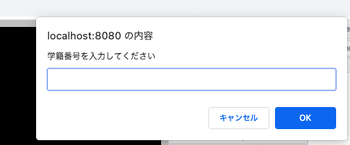
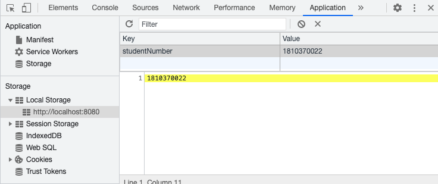
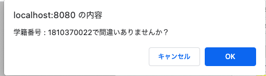
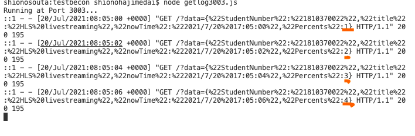

# HLSappの説明(fp送信)

## 機能の説明
このwebアプリケーションリモート授業の動画(hls)配信を行います.

また、『学籍番号、端末情報、現在時間、ページタイトル、現在何％視聴したか、現在どこを視聴しているか』のログを取得しサーバに送信します.

<!-- 初回にアクセスしたときのページの画像です

このテキストボックスに学籍番号を入力してもらうことで,LocalStorageに学籍番号を登録し、「誰が」のデータをとります.
また、この画面はlocalStorageに学籍番号が登録されていない場合に表示されるため、2回目以降でもLocalStorageが削除されていたら表示されます.
LocalStorageの画面です.

 
 
登録ボタンを押すとページがリロードされ、学籍番号が正しいかを確認するアラートが表示されます

このアラートはアクセスされるたびに表示されます.

 
 

「どの動画を」のデータはページのタイトル

「いつ」は現在時刻

「何%まで視聴したか」は動画を何%視聴したか

これらのデータは動画を何%視聴したかの値が更新されるたびにサーバに送信されます.
データ送信先のlocalhost:3003のコンソールです.

 
 
 

 -->

## 使用方法
HLSclassのディレクトリ内で[http-server]コマンドを入力し、http://localhost:8080/HLSclass/hlsapp.html
にアクセスしてください.
 
 

## 各ファイル又はフォルダの説明

### hlsapp.htmlとstyle.css
このwebアプリのhtmlでstyle.cssは背景色を指定しています.

### video.js
HLSで発生するイベントや処理を記載しています.

### checkLocalStrage.js
ユーザーの学籍番号の情報を取得するために使用する、モーダルウィンドウのスクリプトを記載指定ます.

### hls 
出力したいHLSをここに置きます.
形式はm3u8とtsです.

### DescriptionOfHLSclass
webアプリの説明をするこのREADME.mdが置かれています.

### trash
前に使用していたファイルやテストで使用したファイルが置かれています.
webアプリでは使用していないファイルです.

